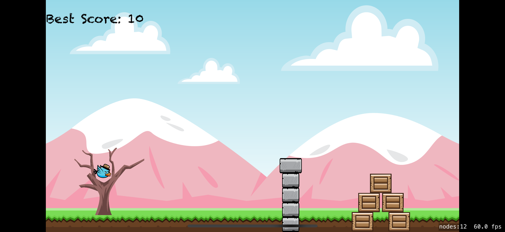
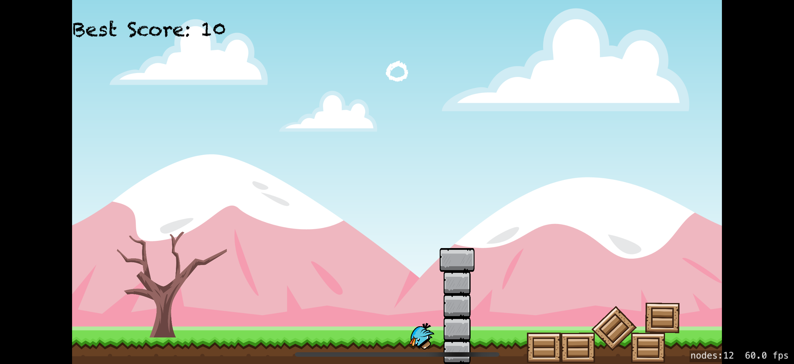

# 🐦 AngryBird Clone - SpriteKit Swift Game

A minimalist Angry Birds-style 2D physics game built using **Swift** and **SpriteKit**.  
Simple drag-and-release gameplay to launch the bird and knock down the boxes!

  
  

---

## 🎮 Gameplay

- Tap and drag the bird to aim
- Release to launch with physics-based impulse
- Hit the boxes and try to get the highest score
- Your best score is saved locally using `UserDefaults`

---

## 🛠 Technologies Used

- **Language:** Swift  
- **Framework:** SpriteKit  
- **Physics Engine:** Built-in SpriteKit Physics  
- **UI Elements:** SKLabelNode, SKSpriteNode  
- **Persistence:** UserDefaults  

---

## 📷 Screenshots

You can find the full-resolution screenshots inside the `Screenshots/` folder:

- `ui.png` – Main UI  
- `ui2.png` – In-game state  

---

## 🚀 Getting Started

1. Open the project in **Xcode**
2. Make sure deployment target is set to iOS 13.0+
3. Build and run on a simulator or real device
4. Drag the bird, release, and enjoy!

---

## 🧠 Learnings

This project was built to better understand:

- SpriteKit basics and scene management  
- Physics body configuration and collision detection  
- Scorekeeping and basic game loop  
- Scene resetting and simple UI updates  

---

## 📁 Folder Structure
